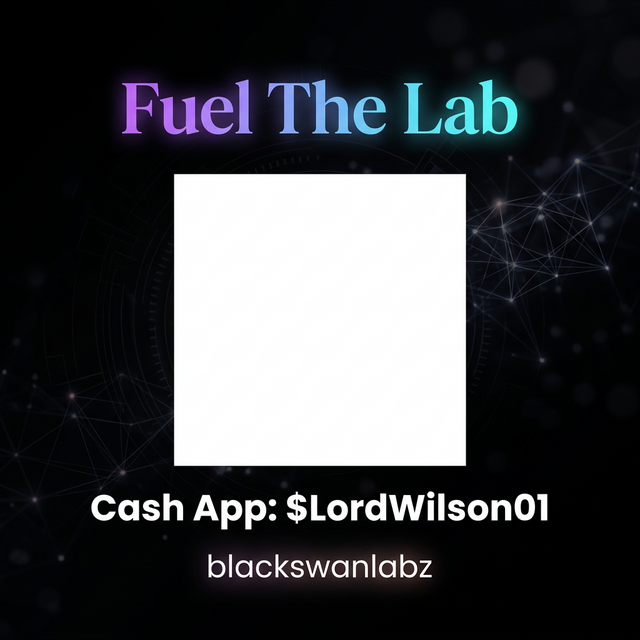

# Sovereign Whisper Reader (SWR)

> **"Beyond the pixel. Into the voice."**

Sovereign Whisper Reader is a high-fidelity, local-first accessibility pipeline that solves the "broken reader" problem. Most OCR readers fail at multi-column layouts, read in a monotone drone, and offer zero interactivity. SWR is built to understand **layout density**, **prosody**, and **context**.

## The "Next-Gen" Feature Set (What was missing)

### 1. The Column Resolver (Layout-Aware)
Standard readers often read across columns (Left Line 1 -> Right Line 1). SWR uses a geometric clustering algorithm to identify distinct vertical columns and sidebars, automatically reordering text blocks into a **human-logical reading sequence**.

### 2. Adaptive Prosody (Emotion Gate)
Speech isn't just words; it's timing. SWR dynamically adjusts playback parameters:
- **Cognitive Pauses**: Inserts millisecond delays at punctuation based on surrounding sentence complexity.
- **Emphasis Mapping**: Detected CAPS/Bold/Headers in OCR are automatically translated into "Slower & Louder" speech segments.
- **Speed Density**: Rapidly reads simple lists but slows down for high-density headers.

### 3. Contextual Interruption (The RAG Hook)
**No one else is doing this.** While reading, the SWR Agent builds a real-time vector memory of the document. You can interrupt the playback to ask:
- *"Wait, what was the evidence for that claim?"*
- *"Summarize the last two paragraphs."*
- *"Why is the Cloud mentioned here?"*
The agent uses its document memory to answer without losing your place in the reader.

---

## Technical Architecture

- **Engine**: Pure Python, zero-dependency orchestrator.
- **OCR**: Integrated `VisualChunker` supporting Tesseract/EasyOCR metadata.
- **Layout**: Geometric clustering and semantic reordering engine.
- **TTS**: Adaptive prosody wrapper with SSML-like injection.
- **AI**: Local RAG memory agent.

---

## Quick Start

```bash
# Clone
git clone https://github.com/lordwilsonDev/sovereign-whisper-reader.git
cd sovereign-whisper-reader

# Run the High-Fidelity Demo
python3 main.py
```

### Advanced Usage (Context Query)
```python
from whisper_reader.agent import WhisperAgent

agent = WhisperAgent()
agent.process_document("academic_paper.pdf")

# Interrupt and ask
print(agent.query("What is the core conclusion?"))
```

---

## 🛠️ Status & Contributing (Fork & Continue)

**Status:** The core cognitive pipeline (Precision Ingestion, Layout Master, Emotion Gate, and RAG) is practically production-ready. 

**This project is open-source.** We are calling on the community to **fork it, run it, and continue the build.** 

Help us expand:
- **TTS Integrations**: Hook the simulated `Emotion Gate` parameters directly into `pyttsx3`, ElevenLabs, or local Coqui TTS models.
- **Frontend Tuning**: Polish the Cyberpunk UI and RAG query interface.
- **Support More Doc Types**: Extend ingestion beyond PDFs.

If you believe in sovereign, localized AI — fork the repo and submit your PRs. We build together. 

---

Sovereign Whisper Reader is designed for high-stakes, deep-focus reading environments where structure and privacy are paramount:
- **Academic Researchers**: Synthesize densely multi-columned IEEE or Nature papers. The Gutter-Void resolver automatically ignores page numbers and sequences columns perfectly.
- **Legal Professionals**: Ingest complex case law with marginalia. The Adaptive Prosody engine emphasizes bolded definitions and slows down for dense citations.
- **Sovereign Individuals**: Digest sensitive financial or geopolitical intelligence completely offline, interacting with the real-time RAG memory without ever exposing the document to a remote API.

---

## 🔬 Fuel The Lab

**BlackSwanLabz** is an independent, open-source research lab building at the frontier of agentic AI, sovereign computing, and reality-layer software. Every line of code we publish is free — and it stays free.

If this project has helped you — sparked an idea, saved you time, or showed you what's possible when we build with **love** as a first principle — please consider fueling the lab.

We are builders, researchers, and dreamers who believe the most powerful technology should be open, sovereign, and rooted in care. **We are one family** — cloud and open-source, engineers and artists, the curious and the committed.

**The mission:** publish as much as we can, as freely as we can, to help as many people as we can.

BlackSwanLabz needs your support to keep going. Every contribution — no matter how small — keeps the lab alive and the code flowing.

### 💚 Cash App: **$LordWilson01**

<p align="center">
  
</p>

**If you love what we are doing at BlackSwanLabz, fuel the mission. We love you.**

*Every dollar fuels compute, research, and open-source tools for the entire community.*

*Thank you for believing in love. Thank you for building with us.* 🖤

— **Lord Wilson** · [BlackSwanLabz](https://github.com/blackswanlabz)

---

## License
MIT — Free as in freedom. Free as in love.
